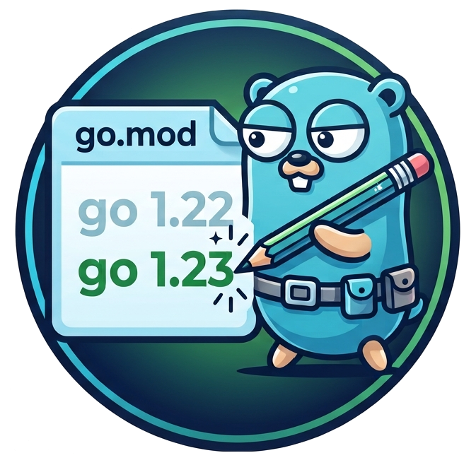

# gomod-go-version-updater-action

[](https://github.com/030/gomod-go-version-updater-action/releases)
[](LICENSE)

</a>

The rationale for this action is that
[Dependabot cannot](https://github.com/dependabot/dependabot-core/issues/9057)
update the go version that is defined in a `go.mod` file.

## Usage

1. To use this action, ensure that:
   `Allow GitHub Actions to create and approve pull requests` option has been
   enabled in the action settings. In order to find this, attach:
   `/settings/actions` to the project URL, i.e.:
   `https://github.com/<owner>/<project-name>/settings/actions`.
1. Once the setting has been enabled, create a
   `~/.github/workflows/gomod-go-version-updater.yml` file with the following
   content:
   ```yml
   ---
   name: gomod-go-version-updater-action
   "on":
     schedule:
       - cron: "42 6 * * *"
     workflow_dispatch:
   permissions:
     contents: write
     pull-requests: write
   jobs:
     gomod-go-version-updater-action:
       runs-on: ubuntu-22.04
       steps:
         - uses: 030/gomod-go-version-updater-action@v0.1.6
   ```
1. To ensure that an action is triggered for testing the Golang version update,
   add a `pull_request_review` trigger. This will cause a specific Workflow
   Action to run whenever someone submits a review for the pull request created
   by the **gomod-go-version-updater-action**:
   ```yml
   "on":
     # required by gomod-go-version-updater to trigger this action once pr has
     # been reviewed
     pull_request_review:
       types: [submitted]
   ```
1. Optional: if private go modules have to be downloaded:
   ```yml
   - uses: 030/gomod-go-version-updater-action@v0.1.6
     with:
       github-token-for-downloading-private-go-modules: ${{ secrets.GITHUB_TOKEN }}
   ```
1. Optional: set the log level to `DEBUG`, `WARNING`, `ERROR` or `CRITICAL`
   (default: INFO):
   ```yml
   - uses: 030/gomod-go-version-updater-action@v0.1.6
     with:
       gomod-go-version-updater-action-log-level: DEBUG
   ```
1. Optional: add an extra label to the PR that will be created:
   ```yml
   - uses: 030/gomod-go-version-updater-action@v0.1.6
     with:
       extra-pr-label: something
   ```

## Digest pinned Dockerfiles

A `Dockerfile` that pins the image by tag *and* digest is updated in full:

```dockerfile
-FROM golang:1.26.6-alpine@sha256:3889b425...2d83 AS builder
+FROM golang:1.27.0-alpine@sha256:4c9fe601...6dbc AS builder
```

The digest of the new tag is looked up anonymously on Docker Hub. Docker
resolves a `tag@digest` reference by digest and ignores the tag, so leaving the
old digest in place would keep building with the previous Go version while the
`go.mod` file already requires the new one.

A rate limited or dropped request is retried with an exponential backoff, and a
`Retry-After` header is honoured, because the anonymous pull limit is shared
with every other job running on the same GitHub runner IP. A `404` is not
retried: that tag is simply not there.

If the lookup still fails - the registry stays unreachable, or the `golang`
image for the new version has not been published yet, which happens because
<https://go.dev/dl> lists a release before the official image is built - nothing
is written at all and the workflow run fails. No pull request is created, so a
`Dockerfile` that can no longer be bumped, for instance because its base image
variant was dropped in the new Go release, is visible instead of silently
landing in a pull request. The next scheduled run tries again.

## Development

If you want to develop on this action, you'll probably want to use a virtual environment. Feel free to arrange that in any way you want, but it could be as simple as running

```python
python3 -m venv .venv
```

Don't forget to activate the virtual environment next:

```bash
source .venv/bin/activate
```

To install the dependencies to work on the project, you can use `pip`:

```bash
pip install '.[dev]'
```

To run the test suite run:

```bash
pytest
```

## Test

Besides the test suite we run with `pytest` (see above) we run a more extensive set as part of quality control. See the run steps that are defined in
[this GitHub Workflow](.github/workflows/python.yml) for details.
